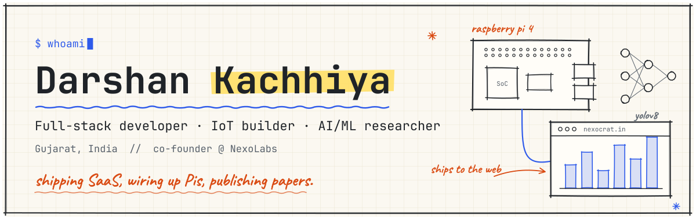
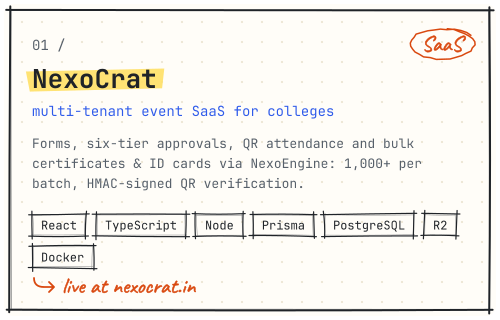
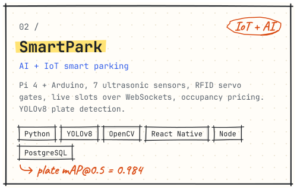
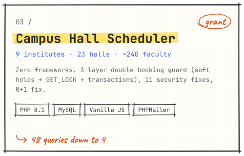
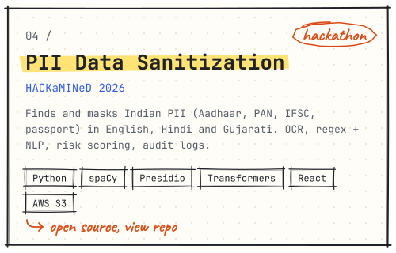
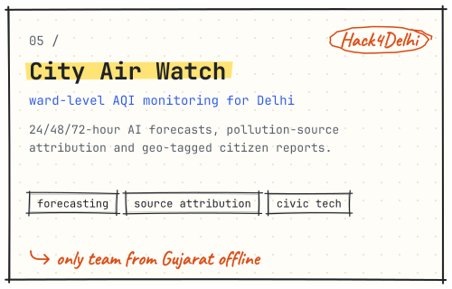
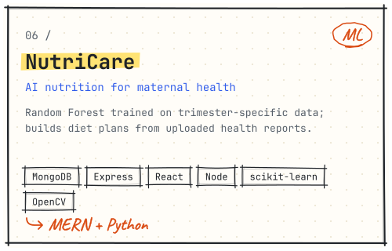
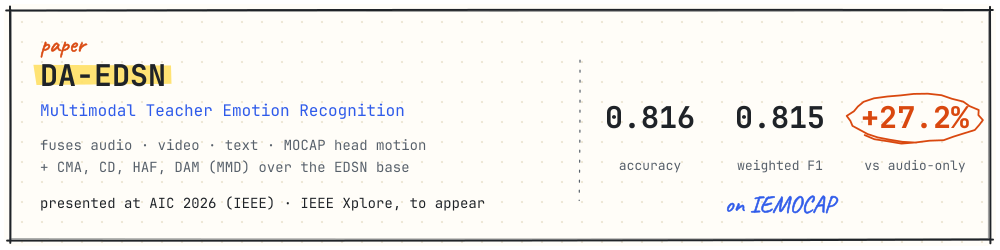

<picture><source media="(prefers-color-scheme: dark)" srcset="assets/banner-dark.svg"></picture>

  
  
  
  
  

 

<picture><source media="(prefers-color-scheme: dark)" srcset="assets/h-about-dark.svg"></picture>

Computer Engineering student at **CSPIT, CHARUSAT University** and co-founder of **[NexoLabs Product Studio](https://nexolabs.in)**, the team behind **[NexoCrat](https://nexocrat.in)**. I like work that crosses layers: multi-tenant SaaS, Raspberry Pi + Arduino systems with computer vision, and multimodal deep learning. My paper **DA-EDSN** was presented at **AIC 2026 (IEEE)**.

 

<picture><source media="(prefers-color-scheme: dark)" srcset="assets/h-now-dark.svg"></picture>

-  **Building** NexoCrat · NexoLabs Mail · a QR inventory system for a packaging print company
-  **Designing** QueryLens, a LeetCode-style platform for learning SQL
-  **Up next** a React Native app that controls SMS-based pump switches from one screen
-  **Learning** FastAPI, for QueryLens
-  **Ask me about** SaaS architecture, Raspberry Pi/Arduino builds, YOLOv8, Claude Code workflows
-  **Fun fact** I automated my society's 30-year-old Janmashtami drama. Motors, lights and voice-over all run off a Raspberry Pi.

 

<picture><source media="(prefers-color-scheme: dark)" srcset="assets/h-projects-dark.svg"></picture>

  <a href="https://nexocrat.in"><picture><source media="(prefers-color-scheme: dark)" srcset="assets/card-nexocrat-dark.svg"></picture></a>
  <a href="https://github.com/Darshan2139?tab=repositories"><picture><source media="(prefers-color-scheme: dark)" srcset="assets/card-smartpark-dark.svg"></picture></a>
  <a href="https://github.com/Darshan2139?tab=repositories"><picture><source media="(prefers-color-scheme: dark)" srcset="assets/card-hall-dark.svg"></picture></a>
  <a href="https://github.com/Darshan2139/PII-DATA-SANITIZATION"><picture><source media="(prefers-color-scheme: dark)" srcset="assets/card-pii-dark.svg"></picture></a>
  <a href="https://github.com/Darshan2139?tab=repositories"><picture><source media="(prefers-color-scheme: dark)" srcset="assets/card-airwatch-dark.svg"></picture></a>
  <a href="https://github.com/Darshan2139?tab=repositories"><picture><source media="(prefers-color-scheme: dark)" srcset="assets/card-nutricare-dark.svg"></picture></a>

<b>More projects</b> (11)

 

- **NexoLabs Mail** · multi-Google-account inbox + Brevo bulk campaigns (CSV merge fields, brand groups, delivery tracking, auto-retry) · React, Node/Express, PostgreSQL (Neon), Cloudflare
- **Cylinder Inventory** · QR scan-in/scan-out for ~20,000 printing cylinders, damage reports, scrap approvals, QR label printing; built for multi-tenant resale · client work via NexoLabs
- **QueryLens** · SQL practice platform with a sandboxed query engine, streaming AI tutor, optimisation feedback, leaderboards · FastAPI, PostgreSQL · *in design*
- **NutriMunch** · diet-management platform for a dietitian client · React, Tailwind, Node/Express, PostgreSQL, Gemini API, Brevo
- **StatementHub** · AI bank-statement manager running on an offline model · Vercel
- **SkillMart** · full LMS · React, Redux Toolkit, Tailwind, Node, Express, MongoDB, Cloudflare R2, Brevo, Razorpay, Gemini API
- **Festival stage automation** · Raspberry Pi 4 + relay board; timeline editor syncs motors and lights to the voice-over, fully offline · plus a Gujarati/English story site opened by QR
- **SSCC** · Smart Stabilizer Cooling Controller for home appliances · Arduino, ESP8266/ESP32, React, Express, NTP time sync
- **GSM Pump Control** · React Native app for SMS-controlled pump switches with timers, power status and background running · *planned*
- **BananiApp** · calculation and management app for a banana-export business
- **TripKrafter** · my first project: a custom travel-package builder with admin, customer and agency modules · HTML, PHP, MySQL

 

<picture><source media="(prefers-color-scheme: dark)" srcset="assets/h-research-dark.svg"></picture>

<picture><source media="(prefers-color-scheme: dark)" srcset="assets/research-dark.svg"></picture>

 

<picture><source media="(prefers-color-scheme: dark)" srcset="assets/h-experience-dark.svg"></picture>

| Role | Where | When |
|---|---|---|
| Co-founder & developer | [NexoLabs Product Studio](https://nexolabs.in), makers of NexoCrat | present |
| Co-founder | Terra Ventures: EV auto-rickshaw rental & booking, then import-export | present |
| Full Stack Development Intern | Cognifyz | Apr 2025 |
| Intern, Web Design with MERN Stack | Brainybeam | Jun 2025 |

 

<picture><source media="(prefers-color-scheme: dark)" srcset="assets/h-stack-dark.svg"></picture>

| | |
|---|---|
| **languages** | <picture><source media="(prefers-color-scheme: dark)" srcset="https://skillicons.dev/icons?i=py,js,ts,java,c,cpp,php&theme=dark"></picture> |
| **frontend** | <picture><source media="(prefers-color-scheme: dark)" srcset="https://skillicons.dev/icons?i=react,nextjs,vite,tailwind,redux,materialui&theme=dark"></picture> |
| **backend & data** | <picture><source media="(prefers-color-scheme: dark)" srcset="https://skillicons.dev/icons?i=nodejs,express,prisma,postgres,mongodb,mysql,firebase&theme=dark"></picture> |
| **ai / ml** | <picture><source media="(prefers-color-scheme: dark)" srcset="https://skillicons.dev/icons?i=sklearn,tensorflow,opencv&theme=dark"></picture> |
| **cloud & devops** | <picture><source media="(prefers-color-scheme: dark)" srcset="https://skillicons.dev/icons?i=aws,vercel,cloudflare,docker&theme=dark"></picture> |
| **hardware** | <picture><source media="(prefers-color-scheme: dark)" srcset="https://skillicons.dev/icons?i=raspberrypi,arduino&theme=dark"></picture> |
| **tools** | <picture><source media="(prefers-color-scheme: dark)" srcset="https://skillicons.dev/icons?i=git,github,figma,latex&theme=dark"></picture> |

also: React Native · shadcn/ui · Zustand · YOLOv8 · spaCy · Hugging Face · Gemini API · Railway · Render · ESP8266/ESP32 · GrovePi+ · RFID · Stripe · Razorpay · Brevo · Claude Code · MCP

 

<picture><source media="(prefers-color-scheme: dark)" srcset="assets/h-achievements-dark.svg"></picture>

| When | What |
|---|---|
| Aug 2026 |  **AIC 2026 (IEEE)**: paper presented, Certificate of Presentation |
| Jan 2026 |  **Hack4Delhi** (IEEE NSUT × HN India): only team from Gujarat in the offline round |
| Aug 2025 |  **Odoo Hackathon 2025**: finalist, offline round in Gandhinagar |
| Mar 2025 |  **HackNUthon 6.0** (Nirma University): 9th place, Top 10 nationally |
| Feb–Mar 2025 |  **Odoo × CHARUSAT Hackathon**: core team, 1 lakh+ reach on Instagram |
| Jan 2025 |  **NSS SmileFiesta**: organiser of a university-wide cultural event |
| 2023 – now |  **Department Media Team**: visual content and media |

<b>Certifications</b>

 

- Deep Learning and Reinforcement Learning · IBM (Coursera) · Aug 2025
- Exploratory Data Analysis for Machine Learning · IBM (Coursera) · Jul 2025
- Server-side JavaScript with Node.js · NIIT (Coursera) · Aug 2025
- Model Context Protocol: Advanced Topics + Claude Code · Anthropic
- AWS Student Community Day · AWS Academy Cloud Developing
- GDSC ML Study Jams

<b>Beyond code</b>

 

-  Photography and videography; wrote NexoCrat's AI-video promo scripts and style guide
-  I help founders with Indian business registration: trademarks (IP India) and company names (MCA SPICe+)
-  On repeat: Lana Del Rey and similar artists

 

  <picture><source media="(prefers-color-scheme: dark)" srcset="https://github-readme-stats.vercel.app/api?username=Darshan2139&show_icons=true&rank_icon=github&bg_color=0F141B&title_color=E6EDF3&text_color=8B949E&icon_color=79A8FF&hide_border=true"></picture>
  <picture><source media="(prefers-color-scheme: dark)" srcset="https://github-readme-stats.vercel.app/api/top-langs/?username=Darshan2139&layout=compact&langs_count=6&bg_color=0F141B&title_color=E6EDF3&text_color=8B949E&icon_color=79A8FF&hide_border=true"></picture>

 

<picture><source media="(prefers-color-scheme: dark)" srcset="assets/h-connect-dark.svg"></picture>

Open to collaborations, freelance builds and research conversations. Fastest reply: **darshankachhiya.ce@gmail.com**

  
  
  
  
  

